<!--
  ============================================================
  8585vishal — GitHub Profile README
  AI Engineering Command Center
  ------------------------------------------------------------
  Animated with pure SVG (SMIL) — no JavaScript, GitHub-safe.
  All content is verified. Do not add fabricated metrics,
  patent numbers, employers, or statistics.
  ============================================================
-->

<!-- ========================= HERO ========================= -->

  

  

<!-- ========================= CONTACT BAR ========================= -->

  
  
  
  
   
  

  <b>Email:</b> <a href="mailto:vishalvrajpurohit6@gmail.com">vishalvrajpurohit6@gmail.com</a>

<!-- Quick navigation -->

  <a href="#_-systemstatus"><b>Status</b></a> &nbsp;·&nbsp;
  <a href="#_-aboutidentity"><b>About</b></a> &nbsp;·&nbsp;
  <a href="#_-techstack"><b>Tech</b></a> &nbsp;·&nbsp;
  <a href="#_-projectsconstellation"><b>Projects</b></a> &nbsp;·&nbsp;
  <a href="#_-architecturefullstack"><b>Architecture</b></a> &nbsp;·&nbsp;
  <a href="#_-timelineexperience"><b>Experience</b></a> &nbsp;·&nbsp;
  <a href="#_-certswall"><b>Certs</b></a> &nbsp;·&nbsp;
  <a href="#_-githubstats"><b>Stats</b></a>

<!-- ========================= SYSTEM STATUS ========================= -->

  

  

<!-- ========================= ABOUT ========================= -->

  

  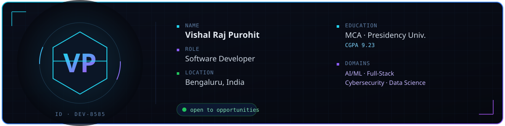

  <table width="90%">
    <tr>
      <td width="65%" valign="top">
        

          <strong>Hi — I’m Vishal Raj Purohit.</strong> I’m a software developer in Bengaluru specialising in AI/ML, full‑stack web applications, and cybersecurity. I’m currently completing my <strong>MCA at Presidency University (CGPA 9.23)</strong> after a <strong>BCA at KLE Society's Degree College (CGPA 9.18)</strong>.
        

        

        

        
        

        

        <table>
          <thead>
            <tr>
              <th align="left">When</th>
              <th align="left">Role / Program</th>
              <th align="left">Organization</th>
            </tr>
          </thead>
          <tbody>
            <tr>
              <td><strong>2022 – 2024</strong></td>
              <td>BCA · Computer Applications  <small>CGPA: 9.18</small>
                 <small>Focus: foundational coursework in algorithms, databases, and software development.</small></td>
              <td>KLE Society's Degree College</td>
            </tr>
            <tr>
              <td><strong>Nov 2023</strong></td>
              <td>Data Science Intern <small>Worked on exploratory data analysis, feature engineering, and prototype models.</small></td>
              <td>CodSoft</td>
            </tr>
            <tr>
              <td><strong>Dec 2023</strong></td>
              <td>Data Science Intern <small>Built preprocessing pipelines and evaluation pipelines for classification tasks.</small></td>
              <td>Bharat Intern</td>
            </tr>
            <tr>
              <td><strong>Jan 2024</strong></td>
              <td>Data Analytics Intern <small>Delivered dashboards, SQL analyses, and stakeholder-facing reports.</small></td>
              <td>Internship Studio</td>
            </tr>
            <tr>
              <td><strong>2024 – 2026</strong></td>
              <td>MCA · Computer Applications  <small>CGPA: 9.23</small>
                 <small>Advanced study in machine learning, distributed systems, and software engineering.</small></td>
              <td>Presidency University</td>
            </tr>
            <tr>
              <td><strong>Feb 2026</strong></td>
              <td>Data Analyst Intern <small>Performed data cleaning, reporting, and model validation for analytics projects.</small></td>
              <td>Accurate Info-Solutions</td>
            </tr>
          </tbody>
        </table>

        
<small>2022–2024 — BCA (KLE Society's Degree College, CGPA 9.18) • Nov 2023 — Data Science Intern, CodSoft • Dec 2023 — Data Science Intern, Bharat Intern • Jan 2024 — Data Analytics Intern, Internship Studio • 2024–2026 — MCA (Presidency University, CGPA 9.23) • Feb 2026 — Data Analyst Intern, Accurate Info-Solutions</small>

        

          <li><strong>Status:</strong> Open to opportunities</li>
          <li><strong>Contact:</strong> <a href="mailto:vishalvrajpurohit6@gmail.com">vishalvrajpurohit6@gmail.com</a></li>
        </ul>
      </td>
    </tr>
  </table>

<!-- ========================= TECH STACK ========================= -->

  

  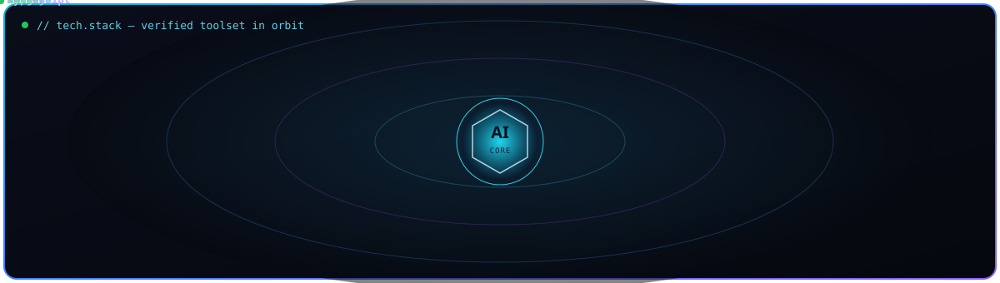

  
   
  
   
  
   
  

| Domain | Technologies |
| :--  
| Languages | Python · Java · JavaScript · TypeScript |
| Frontend | React · HTML · CSS |
| Backend | Node.js · Express · REST APIs |
| Databases| MongoDB · MySQL · Firebase |
| AI / ML | Deep learning (CNN · Vision Transformers) · NLP · LLM integration |
| Cloud & DevOps | AWS · Docker · Git · Linux |

<small>Key credentials: Crash Course on Python (Google) • Generative AI Professional (Oracle) • Certified AI Foundations Associate (Oracle) • FutureSkills Prime (NASSCOM) • AWS Cloud • UiPath Automation (ICT Academy) • Learnathon 2023 (ICT Academy) • Software Engineering (JPMorgan Chase & Co. — Forage) • Technical Consulting (SAP — Forage) • Data Analytics & Visualization (Accenture — Forage) • AI for Everyone (IBM) • Cyber Security (Techbyheart)</small>

<!-- ========================= PROJECTS ========================= -->

  

  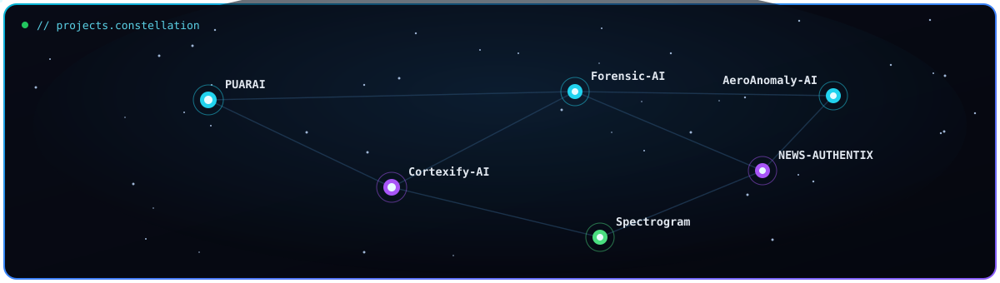

  <table width="90%" style="table-layout:fixed;">
    <tr>
      <td valign="top" width="50%" style="padding:8px;">
        

          
<strong>⭐ PUARAI</strong> — TypeScript · AI/ML

          
Flagship AI-driven application and actively maintained codebase. <a href="https://github.com/8585vishal/PUARAI">View on GitHub</a>

        

        

          
<strong>📰 NEWS-AUTHENTIX</strong> — ML · NLP

          
Fake-news detection using machine learning and NLP. <a href="https://github.com/8585vishal/NEWS-AUTHENTIX-">View on GitHub</a>

        

        

          
<strong>🕵️ Forensic-AI (private)</strong> — CNN · ViT

          
Synthetic-media forensics for deepfake and AI-generated-text detection.

        

      </td>

      <td valign="top" width="50%" style="padding:8px;">
        

          
<strong>🔐 Cortexify-AI</strong> — LLM · Real-time · Security

          
Real-time secure AI conversation platform (patent approved). <a href="https://github.com/8585vishal/Cortexify-AI">View on GitHub</a>

        

        

          
<strong>📡 Spectrogram DCNN</strong> — DCNN · Anomaly Detection

          
Spectrogram-image-based network anomaly detection. <a href="https://github.com/8585vishal/Spectrogram-image-based-Network-Anomaly-Detection-System-using-DCNN">View on GitHub</a>

        

        

          
<strong>✈️ AeroAnomaly-AI (private)</strong> — Anomaly Detection · AI/ML

          
Anomaly-detection applied to aerospace and operational telemetry data.

        

      </td>
    </tr>
  </table>

  
<b>📂 Browse all repositories</b>

   

  

    <table width="95%" style="table-layout:fixed;">
      <tr>
        <td valign="top" width="50%" style="padding:8px;">
          <!-- left column projects -->
          

            
<strong>PUARAI</strong> — TypeScript · AI/ML

            
<a href="https://github.com/8585vishal/PUARAI">github.com/8585vishal/PUARAI</a>

          

          

            
<strong>PU-AR-AI</strong>

            
<a href="https://github.com/8585vishal/PU-AR-AI">github.com/8585vishal/PU-AR-AI</a>

          

          

            
<strong>Cort-ai</strong>

            
<a href="https://github.com/8585vishal/Cort-ai">github.com/8585vishal/Cort-ai</a>

          

          

            
<strong>NEWS-AUTHENTIX</strong> — ML · NLP

            
<a href="https://github.com/8585vishal/NEWS-AUTHENTIX-">github.com/8585vishal/NEWS-AUTHENTIX-</a>

          

          

            
<strong>Sentiment-Analysis</strong>

            
<a href="https://github.com/8585vishal/Sentiment-Analysis">github.com/8585vishal/Sentiment-Analysis</a>

          

          

            
<strong>Multilingual Chatbot Web Application</strong>

            
<a href="https://github.com/8585vishal/Multilingual-Chatbot-Web-Application">github.com/8585vishal/Multilingual-Chatbot-Web-Application</a>

          

          

            
<strong>Iris-Flower Classification with ML</strong>

            
<a href="https://github.com/8585vishal/Iris-Flower-Type-Prediction-and-Classification-with-ML">github.com/8585vishal/Iris-Flower-Type-Prediction-and-Classification-with-ML</a>

          

        </td>

        <td valign="top" width="50%" style="padding:8px;">
          <!-- right column projects -->
          

            
<strong>Cortexify-AI</strong> — LLM · Real-time · Security

            
<a href="https://github.com/8585vishal/Cortexify-AI">github.com/8585vishal/Cortexify-AI</a>

          

          

            
<strong>Spectrogram DCNN</strong> — DCNN · Anomaly Detection

            
<a href="https://github.com/8585vishal/Spectrogram-image-based-Network-Anomaly-Detection-System-using-DCNN">github.com/8585vishal/Spectrogram-image-based-Network-Anomaly-Detection-System-using-DCNN</a>

          

          

            
<strong>Forensic-AI</strong> — (private) · CNN · ViT

            
Private repository (forensics research)

          

          

            
<strong>E-Commerce Fraud Detection</strong>

            
<a href="https://github.com/8585vishal/E-Commerce-Fraud-Detection">github.com/8585vishal/E-Commerce-Fraud-Detection</a>

          

          

            
<strong>Early Prediction of Lifestyle Diseases</strong>

            
<a href="https://github.com/8585vishal/Early-Prediction-of-Lifestyle-Diseases">github.com/8585vishal/Early-Prediction-of-Lifestyle-Diseases</a>

          

          

            
<strong>Mental Health Treatment Prediction</strong>

            
<a href="https://github.com/8585vishal/Mental-Health-Treatment-Prediction">github.com/8585vishal/Mental-Health-Treatment-Prediction</a>

          

          

            
<strong>Crop-AI</strong>

            
<a href="https://github.com/8585vishal/Crop--AI">github.com/8585vishal/Crop--AI</a>

          

        </td>
      </tr>
    </table>
  

<!-- ========================= ARCHITECTURE ========================= -->

  

  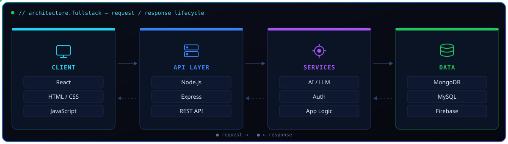

I build production-ready full-stack applications with a React front end, a Node.js + Express API layer, and modular services—including AI/LLMs, authentication, and business logic. I select data stores (MongoDB, MySQL, Firebase) to fit each use case and design systems for clear separation of concerns, scalability, observability, and reliable request/response flows.

<!-- ========================= NEURAL NET ========================= -->

  

  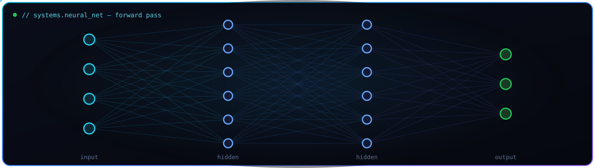

<!-- ========================= SECURITY ========================= -->

  

  

Security is a through-line in my systems work: I design and ship end-to-end detection & response pipelines—network-anomaly detection (spectrogram DCNNs), synthetic-media forensics (Forensic-AI), dark-web threat intelligence, and real-time monitoring. I integrate telemetry, SIEM-style correlation, alerting and automated containment to build systems that detect, explain, and remediate threats with low latency.

<!-- ========================= TIMELINE ========================= -->

<!-- Duplicate timeline block removed; main timeline table is defined earlier in the README. -->

<!-- ========================= DNA / SKILLS RADAR ========================= -->

  

  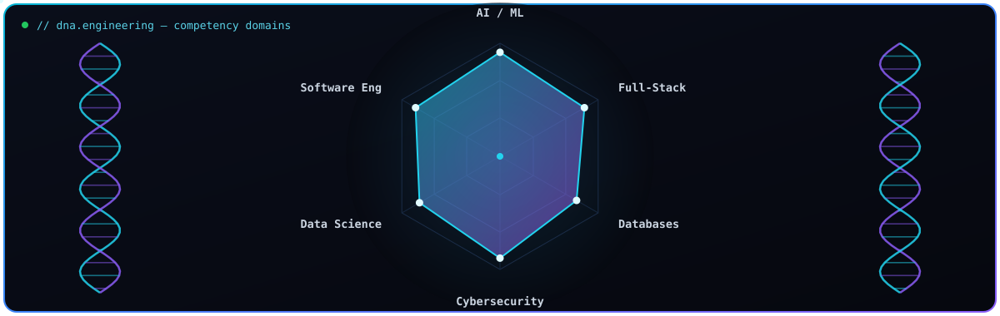

<!-- ========================= CERTIFICATIONS ========================= -->

  

  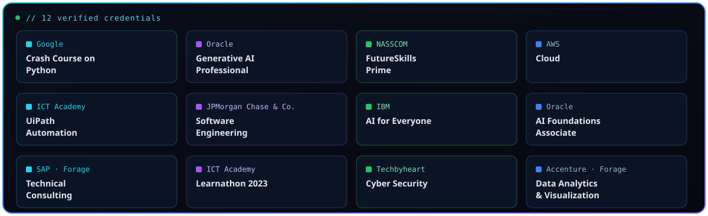

| Credential Issuer |
| :-- 
| Crash Course on Python | Google |
| Generative AI Professional | Oracle |
| Certified AI Foundations Associate | Oracle |
| FutureSkills Prime | NASSCOM |
| Cloud | AWS |
| UiPath Automation | ICT Academy |
| Learnathon 2023 | ICT Academy |
| Software Engineering | JPMorgan Chase & Co. *(Forage)* |
| Technical Consulting | SAP *(Forage)* |
| Data Analytics & Visualization | Accenture *(Forage)* |
| AI for Everyone | IBM |
| Cyber Security | Techbyheart |

<!-- ========================= GITHUB STATS ========================= -->

  

  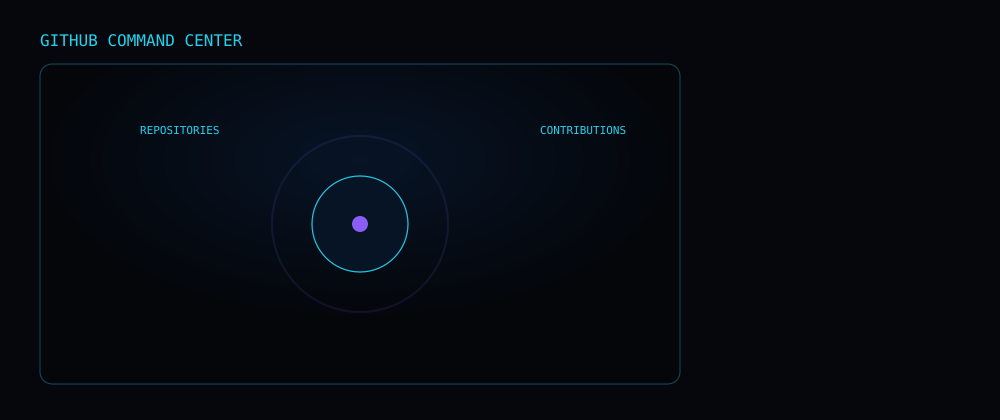

  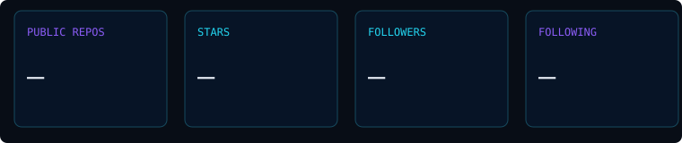

  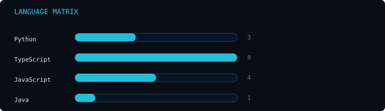

  

  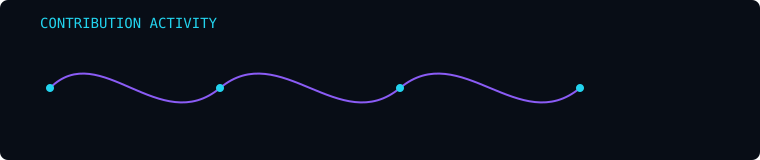

  <a href="https://github.com/8585vishal">
    <b>VIEW FULL GITHUB PROFILE →</b>
  </a>

<!-- ========================= FOOTER ========================= -->

  <a href="https://linkedin.com/in/vishal-raj-purohit-b3a0492a4"><b>LinkedIn</b></a> &nbsp;·&nbsp;
  <a href="https://vishalrajpurohit.vercel.app"><b>Portfolio</b></a> &nbsp;·&nbsp;
  <a href="mailto:vishalvrajpurohit6@gmail.com"><b>Email</b></a>

# Profile-Overview


